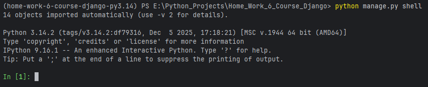
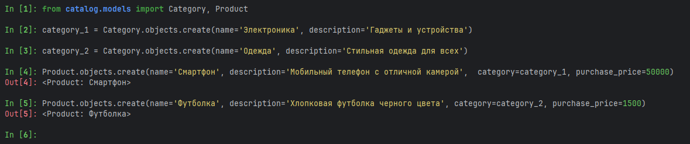
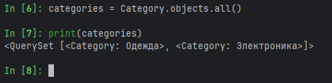
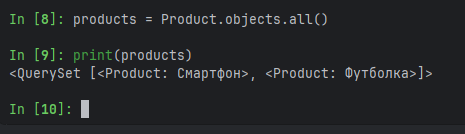
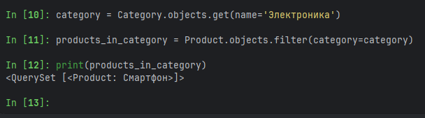
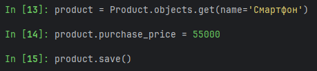
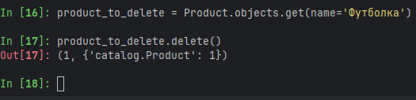

### 1. Вход в Django Shell

### 2. Создание нескольких категорий и продуктов

### 3. Запрос на получение всех категорий

### 4. Запрос на получение всех продуктов

### 5. Запрос на поиск всех продуктов в категории

### 6. Обновление цены для определенного продукта

### 7. Удаление продукта
